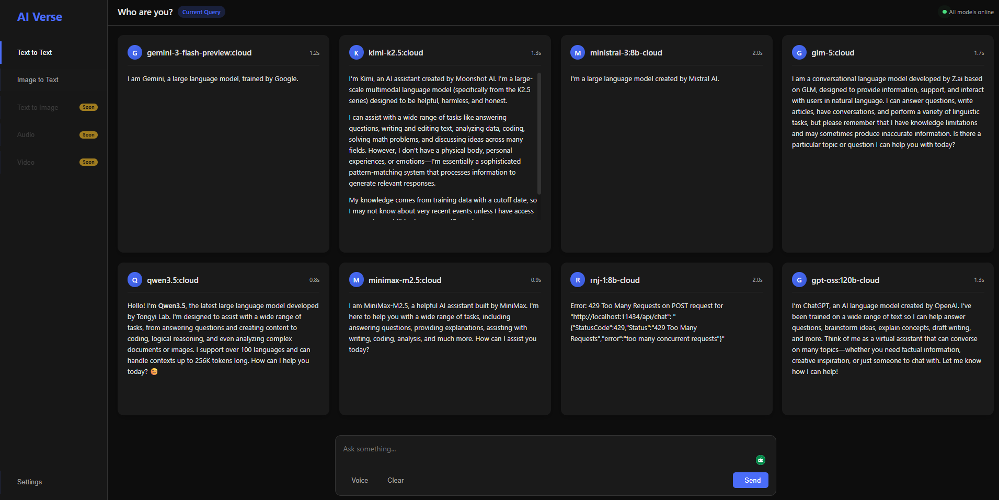

# AIVerse

**AIVerse** is an open-source multimodal AI comparison platform that allows users to send a single prompt to multiple AI models and compare their responses side-by-side in real time.

---  

## Screenshot



---

## Features

* Compare multiple AI models in parallel
* Single prompt → multiple responses
* Side-by-side response comparison
* Clean and simple user interface
* Fast and scalable backend
* Extensible architecture for adding new AI models
* Open-source and community-driven

---

## Getting Started

### Prerequisites

* Java 17 or higher
* Maven 3.9 or higher
* Git

---

### Clone the repository

```bash
git clone https://github.com/AkashKobal/aiverse.git
cd aiverse
```

---

### Run the project

```bash
mvn spring-boot:run
```

---

### Access the application

Open your browser and go to:

http://localhost:6768

---

## How it works

1. User enters a prompt
2. The system sends the prompt to multiple AI models
3. Responses are collected in parallel
4. The interface displays responses side-by-side for easy comparison

---

## Roadmap

* Integration with multiple AI providers
* Parallel response optimization
* Model performance comparison metrics
* Multimodal support (text, image, audio, video)
* User model selection interface
* Response export and sharing

---

## Contributing

Contributions are welcome.

Steps to contribute:

1. Fork the repository
2. Clone your fork
3. Create a new branch
4. Make your changes
5. Submit a Pull Request

---

## Commit Convention

Use clear commit messages:

feat: add new feature
fix: resolve bug
docs: update documentation
refactor: improve code structure
test: add or update tests

---

## License

MIT License

---

## Author

Akash Kobal
https://github.com/AkashKobal

---

## Vision

To build a unified platform where users can explore, compare, and evaluate AI models efficiently in one place.
